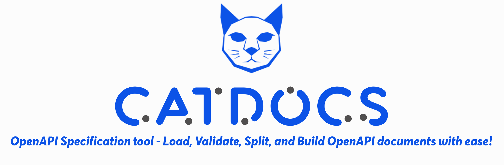

# Catdocs
## Maintain OpenAPI documentations with ease
Welcome to **Catdocs**! This repository contains tools, libraries, and a CLI for managing OpenAPI documentation, specifically designed for teams working collaboratively on APIs.



## Introduction

Catdocs is an OpenAPI documentation tool that streamlines the process of managing API documentation for teams. By enabling the splitting of OpenAPI documents, Catdocs allows different teams or individuals to work on separate parts of the API documentation, ensuring efficient and organized collaboration.

Catdocs is a powerful command-line interface (CLI) tool offering robust support for API management similar to the capabilities provided by
the [Redocly CLI](https://redocly.com/docs/cli/commands).
This tool comes with comprehensive support
for all API management commands in Redocly, excluding the generation of OpenAPI documentation previews and related commands.

## Features

- **OpenAPI Documentation Management**: Easily handle large OpenAPI documents by splitting them into manageable parts.
- **Team Collaboration**: Supports collaborative work by allowing different team members to edit specific sections of the API documentation.
- **External Reference Handling**: Automatically resolves and manages external references in OpenAPI documents.
- **CLI Tool**: Includes a command-line interface for easy integration into your workflow.
- **Validation**: Validates OpenAPI documents to catch errors before publishing.
- **Version Control Integration**: Seamlessly integrates with Git for version control, enabling team members to push and pull changes effortlessly.

## Benefits

- **Scalability**: Manage large and complex OpenAPI documents by breaking them down into smaller, manageable parts.
- **Team Efficiency**: Improve team efficiency by allowing members to focus on their specific areas of responsibility.
- **Error Reduction**: Reduce errors by validating OpenAPI documents before publishing.
- **Seamless Integration**: Integrate Catdocs into your existing workflow with ease, thanks to its CLI and version control capabilities.

## How It Works

1. **Splitting Documentation**: Catdocs splits your main OpenAPI document into multiple files, each representing different parts of the API (e.g., paths, responses, schemas).
2. **Editing Parts Independently**: Team members can work on their assigned parts independently, using their preferred tools.
3. **Merging Changes**: Catdocs merges the individual parts back into a single cohesive OpenAPI document, resolving any references.
4. **Validation**: Before finalizing the documentation, Catdocs validates the OpenAPI document to ensure there are no errors.
5. **Version Control**: Use Git to manage changes, enabling team collaboration and maintaining a history of modifications.

## Getting Started
You should check if .NET 8 is already installed on your system, you can run the following command in your terminal:
```bash
dotnet --version
```

If not, for Windows you have to download .NET 8 SDK, for Linux you can run:
```bash
sudo apt-get update && \
sudo apt-get install -y dotnet-sdk-8.0
```
And for Mac:
```bash
brew update
brew install --cask dotnet-sdk
```

Run the following command to clone the repository:
```bash
git clone https://github.com/imaun/catdocs.git
```
Navigate to the cloned repository's directory and build the project:
```bash
cd catdocs
dotnet build
```
You can now run Catdocs using the dotnet run command followed by the specific command you wish to use. For example, to get statistics of an OpenAPI document:

```bash
dotnet run -- stats --file path/to/your/openapi.yaml --format yaml
```

## Install it with Docker
To use Catdocs CLI with Docker, pull the latest image from Docker Hub and run it:
```bash
docker pull imaun/catdocs:latest
docker run --rm imaun/catdocs:latest <command> [options]
```

## Commands
Catdocs supports several commands to help you work with OpenAPI documents: stats, split, bundle, and convert.

### 0. stats
The stats command analyzes an OpenAPI specification file, validates it, and prints out information about its components such as the number of API paths, request bodies, and responses.

Usage:
```bash
catdocs --file example-openapi.yaml --spec-ver 3 --format json
```
Options:
- **--file** (Aliases: --source, --spec, -s): The path to the OpenAPI spec file.
- **--spec-ver** (Aliases: --spec-version, -v): The OpenAPI specification version (2 or 3). Default is 3.
- **--format**: The format of the OpenAPI file (json or yaml). Default is based on the file extension.

### 1. split
This command splits an OpenAPI document into separate reusable components, each in its own file, with the main document containing references to these components.

Usage:
```bash
catdocs split --file OpenApi.yaml --spec-ver 3 --format yaml --outputDir examples/bundle-pipeline
```

Options:
- **--file** (Aliases: --source, --spec, -s): Path to the source OpenAPI documentation file.
- **--spec-ver** (Aliases: --spec-version, -v): The OpenAPI specification version (2 or 3). Default is 3.
- **--format**: The format of the OpenAPI file (json or yaml). Default is based on the file extension.
- **--outputDir**: The directory path where the output files will be saved. This directory will contain an OpenAPI file with external references to each component file path.

### 2. bundle
This command bundles a previously split OpenAPI file by putting its components back into their places, validates the document, logs any errors, and outputs a single bundled OpenAPI file if there are no validation errors.

Usage:
```bash
catdocs bundle --file examples/bundle-pipeline/OpenApi.yaml --spec-ver 3 --format yaml --output examples/bundle-pipeline/output.yaml
```

Options:
- **--file** (Aliases: --source, --spec, -s): The path to the OpenAPI spec file.
- **--spec-ver** (Aliases: --spec-version, -v): The OpenAPI specification version (2 or 3). Default is 3.
- **--format**: The format of the OpenAPI file (json or yaml). Default is based on the file extension.
- **--output**: The destination filename for the output of this command, a bundled OpenAPI file.

### 4. convert
Converts an OpenAPI document from JSON to YAML or vice versa, depending on the source file format. It also validates the source file and lists any errors found during the process.

Usage:
```bash
catdocs convert --file docs.json --spec-ver 3 --format json --output docs.yaml
```

Options:
- **--file** (Aliases: --source, --spec, -s): The source OpenAPI filename.
- **--spec-ver** (Aliases: --spec-version, -v): The OpenAPI specification version (2 or 3). Default is 3.
- **--format**: The source file format (json or yaml). The output will be in the opposite format.
- **--output**: The destination filename for the output file of this command.

# Integrates into your pipeline
Catdocs is particularly effective when integrated into CI/CD pipelines, facilitating the management of large OpenAPI specifications within a team. By utilizing the bundle command, you can automate the process of combining multiple OpenAPI components into a single document. This is crucial for teams where different members or groups work on separate parts of the API specification.

### Scenario
Imagine a scenario where your API specification is split into multiple components, each maintained in separate files as per the split command's functionality. Each team member contributes to different aspects of the API, such as paths, responses, or schemas, by updating their respective files. Once changes are committed and pushed to the repository, you need a reliable way to combine these individual components back into a cohesive API document.

### Pipeline Integration
To facilitate this, you can incorporate Catdocs into your CI/CD pipeline.
Upon a merge request or push to a specific branch (typically main or master),
the pipeline triggers the bundle command to automatically assemble the updated components into a
final OpenAPI specification. This bundled file can then be pushed back to the repository or passed along to other stages in your pipeline,
such as API testing or deployment.

### Example pipeline
Actually, [Catdocs CI pipeline](https://github.com/imaun/catdocs/blob/55fa3ac30dad3c0f2299fa27f442d8624a4e97c3/.github/workflows/ci.yaml#L26) itself, is an example of a sample pipeline using GitHub Actions.
This setup assumes that the OpenAPI components are stored in a directory structure
created by the split command and that the final bundle should be updated in the repository.

## Using in .NET projects
Since Catdocs OpenAPI is built for .NET developers,
integrating it into your existing .NET applications is seamless.
After adding the package to your project, you can use it's library in your projects.

To begin using Catdocs OpenAPI in your .NET projects, you can easily install it via NuGet. The tool is packaged as a .NET 8 library, making it straightforward to integrate into your existing applications.

You can install the Catdocs.OpenAPI package by running the following command in your project directory:

```bash
dotnet add package Catdocs.OpenAPI
```
This command will download and add the Catdocs.OpenAPI package to your project, allowing you to utilize its features directly within your .NET environment.


or integrate it into your build and CI/CD pipelines.
This integration ensures that your API management processes are tightly coupled with your development workflow, enhancing efficiency and reliability.

## Contributing

We welcome contributions!

## License
This project is licensed under the MIT License. See the [LICENSE](LICENSE) file for details.

## Contact

imun22 with gmail at the end!
